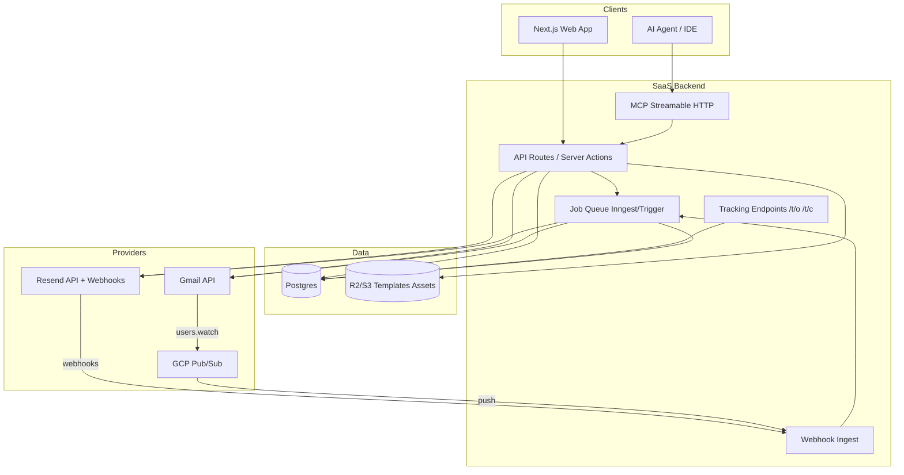

# Cold-Email Tracking + Automation Product — Architecture Research (2026)

**Research date:** 2026-09-04 (Asia/Seoul)  
**Scope:** Multi-account sending (Gmail OAuth/API + Resend), campaign clustering, per-message tracking, templates, stats/memory, MCP server, AI drafting/sequencing  
**Method:** Primary docs via WebSearch + WebFetch; limits cited or marked uncertain. No fabricated API quotas.

---

## Executive recommendation (TL;DR)

**Build a Next.js SaaS MVP first**, with a provider-adapter layer for **Resend (Phase 0)** then **Gmail API (Phase 1)**. Defer Tauri/Electron desktop until you need local-token privacy or offline compose.

| Priority | Choice |
|---|---|
| Surface | **Web SaaS (Next.js App Router)** |
| Data | **Postgres (Supabase or Neon) + RLS** |
| Jobs | **Inngest or Trigger.dev** (webhooks, reminders, watch renewal) |
| Send path | Adapter: `GmailProvider` \| `ResendProvider` |
| Tracking | Own open/click endpoints + **confidence scoring** (MPP-aware); treat opens as weak signals |
| Replies | Gmail: Pub/Sub `users.watch` + `history.list`; Resend: inbound `email.received` on reply subdomain |
| Agent surface | **MCP Streamable HTTP** tools over the same domain model |
| First 1–2 weeks | Campaigns + Resend send + webhooks + templates + reminder jobs + basic stats |

Cold email is deliverability- and compliance-constrained. Prefer **Workspace mailboxes + warm domains + low volume** over blasting. Open rates alone are unreliable in 2026—optimize for **replies, clicks, and booked outcomes**.

---

## 1. Gmail API / Google Workspace

### 1.1 Sending limits (user mailbox vs API quota)

**Google Workspace (paid) — mailbox sending limits**  
Source: [Gmail sending limits in Google Workspace](https://knowledge.workspace.google.com/admin/gmail/gmail-sending-limits-in-google-workspace)

| Limit type | Documented value |
|---|---|
| Messages per day (rolling 24h) | **2,000** (1,500 mail merge; **500** trial) |
| Recipients per message (UI) | 2,000 total (max **500 external**) |
| Recipients per message via **Gmail API** | **500** |
| Recipients per message via SMTP/POP/IMAP | **100** |
| Total recipients per day | **10,000** (1,500 mail merge) |
| External recipients per day | **3,000** |
| Unique recipients per day | **3,000** (2,000 external; 500 external trial) |

Exceeding limits → user cannot send for up to ~24 hours (can still receive). Limits can change without notice.

**Personal Gmail (@gmail.com)**  
Source: [Limits for sending & getting mail](https://support.google.com/mail/answer/22839)

- Error when sending to **more than 500 recipients in a single email** and/or **more than 500 emails sent in a day**.
- Recovery typically **1–24 hours**.

**Gmail API call quotas (quota units)**  
Source: [Usage limits](https://developers.google.com/workspace/gmail/api/reference/quota)

| Quota | Limit |
|---|---|
| Per minute per project | **1,200,000** quota units |
| Per minute per user per project | **6,000** quota units |
| Daily billing threshold per project | **80,000,000** quota units (usage under threshold not billed; billing details planned later in 2026 with ≥90 days notice) |
| `messages.send` / `drafts.send` | **100** units each |
| `watch` | **100** units |
| Recipients per API message | **500** |

**2026 note:** From May 2026 Google is adjusting Workspace API quotas; over-threshold usage may incur Cloud billing later in 2026. See [standardized model for agent tools and APIs](https://developers.google.com/workspace/tools-safety). Exact paid overage pricing: **uncertain / not fully published** as of research date—cite that page when implementing.

### 1.2 OAuth scopes

Source: [Choose Gmail API scopes](https://developers.google.com/workspace/gmail/api/auth/scopes)

| Scope | Sensitivity | Product implication |
|---|---|---|
| `gmail.send` | **Sensitive** | Send-only; best for “send via user’s mailbox” without reading inbox |
| `gmail.compose` | **Restricted** | Drafts + send |
| `gmail.modify` | **Restricted** | Read + compose + send (no permanent delete bypass) |
| `gmail.readonly` | **Restricted** | Read messages/threads (needed for reply detection via API) |
| `mail.google.com/` | **Restricted** | Full access; avoid unless necessary |
| Add-on scopes (`gmail.addons.current.*`) | Non-sensitive / sensitive | Only while add-on UI runs; **not** a substitute for backend SaaS sync |

**Verification reality:** Restricted scopes that store/transmit user data on servers require OAuth verification + often annual **CASA** security assessment ([Google security assessment](https://support.google.com/cloud/answer/13465431), [CASA Tier 2](https://appdefensealliance.dev/casa/tier-2/tier2-overview)).  
**MVP strategy:** Start with `gmail.send` for outbound; add `gmail.readonly` or `gmail.modify` only when reply detection ships—budget weeks for verification, not days.

### 1.3 Watch / Pub/Sub for replies

Source: [Configure push notifications](https://developers.google.com/workspace/gmail/api/guides/push), [history.list](https://developers.google.com/workspace/gmail/api/reference/rest/v1/users.history/list)

Flow:
1. Create GCP Pub/Sub topic; grant publish to `gmail-api-push@system.gserviceaccount.com`.
2. Call `users.watch` with `topicName` (+ optional `labelIds: ["INBOX"]`).
3. On notification: decode `{ emailAddress, historyId }`, call `users.history.list(startHistoryId)`, fetch new messages, match `threadId` to outbound outreach.
4. **Renew `watch` at least every 7 days** (recommend daily).
5. ACK Pub/Sub quickly; process async. Fallback poll if silent gaps (notifications can be delayed/dropped; max ~1 notification/sec/user).

Threading: store Gmail `threadId` + RFC `Message-ID` / `In-Reply-To` / `References` for cross-provider consistency.

### 1.4 Add-ons vs full API apps

| Approach | Pros | Cons |
|---|---|---|
| **Gmail add-on** | Contextual UI in Gmail; narrower add-on scopes | Not a multi-campaign SaaS; limited background automation; not ideal for Resend dual-send |
| **Full API web app** | Multi-account, campaigns, MCP, webhooks | OAuth verification / CASA for restricted scopes; you operate Pub/Sub |

**Recommendation:** Full API app as product core; optional later add-on for “side panel while composing.”

### 1.5 Google sender guidelines (deliverability)

Source: [Email sender guidelines](https://support.google.com/mail/answer/81126), [FAQ](https://support.google.com/mail/answer/14229414)

**All senders (to personal Gmail):** SPF **or** DKIM; valid forward/reverse DNS; TLS; spam rate **&lt; 0.3%** in Postmaster Tools; RFC 5322 formatting; do not impersonate Gmail From headers.

**Bulk (≥5,000/day to Gmail):** SPF **and** DKIM; DMARC published (even `p=none`); From alignment with SPF or DKIM domain; one-click unsubscribe for marketing/subscribed mail (`List-Unsubscribe` + `List-Unsubscribe-Post`).

Enforcement tightened Nov 2025 per Google FAQ (temporary/permanent failures for non-compliance). Cold outreach is often treated as unsolicited—product should enforce consent/suppression tooling and ramp volume slowly.

---

## 2. Resend

### 2.1 Transactional vs marketing

Sources: [Account quotas and limits](https://resend.com/docs/knowledge-base/account-quotas-and-limits), [Usage limits](https://resend.com/docs/api-reference/rate-limit)

- **Transactional Email:** volume quotas (daily/monthly). Free: **100/day**, **3,000/month**. Paid: no daily quota; monthly by plan. **Sent + received both count.** Multiple To/CC/BCC each count.
- **Marketing / Broadcasts:** limited by **contacts** quota (not email volume the same way). Free: unlimited emails to up to **1,000 contacts/month**.
- Product fit: 1:1 cold sequences map better to **transactional send API** + your own campaign engine; use Broadcasts only for true list blasts.

### 2.2 Rate limits & quality gates

| Control | Documented value |
|---|---|
| Default API rate | **10 requests/sec per team** (all keys share pool) |
| Batch API | Up to **100 emails** per batch call (1 request against rate limit) |
| Bounce rate | Keep **&lt; 4%** or sending may pause |
| Spam rate | Keep **&lt; 0.08%** or sending may pause |
| Data retention | **30 days** (store webhooks yourself for history) |

### 2.3 Webhooks

Source: [Event types](https://resend.com/docs/webhooks/event-types)

Email lifecycle events include:  
`email.sent`, `email.delivered`, `email.delivery_delayed`, `email.bounced`, `email.complained`, `email.opened`, `email.clicked`, `email.failed`, `email.scheduled`, `email.suppressed`, `email.received`.

Important semantics:
- **`email.sent` ≠ delivered** — API accepted / outbound attempted.
- **`email.delivered`** — recipient MTA accepted.
- Open/click require tracking enabled.

### 2.4 Custom domains & tracking pixels

Source: [Open and Click Tracking](https://resend.com/docs/dashboard/domains/tracking)

- Tracking **off by default**; Resend suggests open tracking mainly for Broadcasts so transactional mail isn’t classified as marketing.
- Enable `open_tracking` / `click_tracking` + verified **tracking subdomain** (CNAME).
- Open = 1×1 GIF fetch; click = link rewrite via tracking subdomain.

### 2.5 Reply handling limitations

Sources: [Receiving emails](https://resend.com/docs/dashboard/receiving/), [Custom receiving domains](https://resend.com/docs/dashboard/receiving/custom-domains), [`email.received`](https://resend.com/docs/webhooks/emails/received)

- Inbound works on `.resend.app` or custom domain with **MX** (prefer **subdomain** if root already has mailbox MX).
- Webhook payload is **metadata-only**; fetch body via Received Emails API.
- **Limitation for cold email:** Replies typically go to the user’s real mailbox (`From` / `Reply-To`), **not** to Resend inbound—unless you set `Reply-To` to a Resend-receiving address or forward mail.
- Threading: set `In-Reply-To` / `References` when sending follow-ups ([Resend threaded replies docs](https://resend.com/docs/dashboard/receiving/)).

**Design pattern:** For Resend-sent mail, set `Reply-To: replies+{token}@inbound.yourdomain.com` (Resend MX on subdomain) **or** sync replies from Gmail if the From identity is a Gmail/Workspace address (hybrid identity).

---

## 3. Open / pixel tracking realities (2026)

Sources: Apple Mail Privacy Protection behavior (industry + ESP docs), [SendGrid MPP notes](https://www.twilio.com/docs/sendgrid/for-developers/tracking-events/understanding-apple-mail-privacy-protection-and-open-events), analysis summaries e.g. [Sender.net MPP 2026 guide](https://www.sender.net/blog/apple-mail-privacy-protection/)

### What still works
- Pixel fires when an image is fetched (client, proxy, or scanner).
- Click tracking remains a **stronger** engagement signal than opens.
- Reply rate / positive reply rate / meeting booked remain ground truth.

### What breaks “open rate”
- **Apple MPP** prefetches/caches images via Apple proxies → opens without human read; IP/UA anonymized; repeat opens often not re-signaled.
- Gmail image proxy and corporate security gateways (Mimecast, Proofpoint, Defender) also prefetch → false opens.
- Aggregate open rates commonly **inflated**; treat raw opens as **noisy**.

### Product guidance
1. Store opens with metadata: timestamp, IP ASN/range class, UA, latency from delivery.
2. Implement **confidence tiers** (human vs likely-machine); UI defaults to “probable opens” filtered.
3. Primary KPIs: **delivery, bounce, reply, click, unsubscribe/complaint**.
4. Disclose tracking in privacy policy; allow disable per workspace.
5. Do not auto-sequence solely on “opened.”

---

## 4. Reply detection approaches

| Approach | Best for | Strengths | Weaknesses |
|---|---|---|---|
| **Gmail Pub/Sub + history.list** | Gmail/Workspace senders | Near-real-time, official | Restricted scopes + CASA; watch renewal; GCP ops |
| **IMAP IDLE / polling** | Generic IMAP mailboxes | Provider-agnostic | Connection churn, less SaaS-friendly, credential risk |
| **Resend inbound** | ESP-sent with Reply-To capture | Clean webhooks, parsed MIME | Won’t see replies to personal inbox unless Reply-To/forward |
| **Header parsing** | All | Thread via Message-ID / In-Reply-To / References | Need consistent outbound headers |
| **Plus-address / reply tokens** | Attribution | Maps reply → campaign/message | Broken if recipient edits Reply-To |

**Recommended hybrid:**
- Outbound via Gmail → Pub/Sub reply sync on that mailbox.
- Outbound via Resend → `Reply-To` inbound subdomain + optional Gmail sync if From is mailbox-backed.
- Always persist `rfc_message_id`, `thread_key`, `campaign_id`, `touch_id`.

Reminders: queue job `if no reply by T+N and status in (delivered, sent) then remind or enqueue next step`.

---

## 5. MVP stack options

### Recommended: Next.js SaaS (primary)

```
Next.js (App Router) + TypeScript
  ├─ Auth: Supabase Auth / Clerk / Better Auth
  ├─ DB: Postgres (Supabase or Neon) + Drizzle/Prisma
  ├─ Queue: Inngest / Trigger.dev (or BullMQ+Redis)
  ├─ Object/files: S3/R2 for template assets
  ├─ Providers: Gmail OAuth + Resend SDK
  ├─ Tracking: /t/o/:id.gif , /t/c/:id
  └─ MCP: Streamable HTTP at /mcp (same authz model)
```

**Why this wins for THIS product:** OAuth callbacks, Pub/Sub/Resend webhooks, multi-tenant campaigns, shared stats, and remote MCP agents all need a always-on HTTPS backend. Desktop alone cannot receive provider webhooks reliably without a companion cloud.

### Alternative: Tauri / Electron desktop

| Pros | Cons |
|---|---|
| Local secrets; feels like “email client” | Still need cloud for webhooks/watch; packaging tax |
| Native notifications | Multi-device sync harder |
| Possible local IMAP | MCP remote agents prefer HTTP server |

Use later as **thick client** over the same API, not as MVP core.

### Hybrid

- Web app = source of truth.
- Optional desktop for compose UX / local preview.
- Shared OpenAPI + MCP over HTTPS.

### Workers / automation

- Send throttle per account (respect Gmail 500/2k and Resend 10 rps).
- Watch renewal cron (daily).
- Reminder / sequence stepper.
- Webhook ingestion + idempotent event store.
- AI draft jobs (async, not request-path blocking).

---

## 6. MCP server design for email outreach

Align with MCP tools model ([MCP Tools spec 2026-07-28](https://modelcontextprotocol.io/specification/2026-07-28/server/tools)): named tools, JSON Schema inputs, auth per request, deterministic `tools/list` order, validate aggressively.

### Suggested tool surface (MVP → v1)

**Accounts & identity**
- `list_sending_accounts` — connected Gmail/Resend identities + daily remaining capacity (estimated)
- `get_account_health` — bounce/complaint/quota signals

**Campaigns / issues**
- `create_campaign` / `list_campaigns` / `get_campaign`
- `add_prospects` / `list_prospects` (dedupe by email)

**Compose & templates**
- `list_templates` / `render_template` (variables: `{{first_name}}`, company, etc.)
- `preview_email` — returns HTML + text + desktop/mobile preview URLs
- `draft_outreach` — AI draft; **does not send**
- `revise_draft`

**Send & schedule**
- `schedule_send` / `cancel_scheduled` / `send_now` (requires explicit confirmation flag)
- `enqueue_sequence_step`

**History & tracking**
- `search_messages` — by campaign, prospect, status
- `get_thread` — full thread + events
- `get_stats` — reply rate, click rate, filtered open confidence
- `list_events` — delivered/opened/clicked/replied

**Memory / learning**
- `record_outcome` — replied / meeting / not_interested / bounce
- `query_what_worked` — aggregate by template, subject pattern, send hour, account (with sample-size floors)

### Safety rules for agents
- Default **draft-only**; send tools require `confirm: true` and workspace policy.
- Rate-limit tool calls server-side; never trust model to respect Gmail caps.
- Suppress hard bounces / complaints automatically.
- Log every tool invocation with actor (user/agent).
- Scope tokens: read vs send separately if possible.

*(Existing open-source email MCP servers illustrate broad tool catalogs—e.g. multi-account send/schedule/search—but product MCP should be **domain-specific** to campaigns/prospects, not a raw IMAP client.)*

---

## 7. Prototype recommendation (1–2 weeks)

### Build first (Phase 0) — **Web**, Resend-first

1. Auth + workspace + Postgres schema (accounts, campaigns, prospects, messages, events, templates).
2. Connect Resend API key + verify sending domain (SPF/DKIM/DMARC checklist UI).
3. Create campaign → import CSV prospects → pick template → schedule/send with throttle.
4. Ingest Resend webhooks → message status timeline.
5. Optional open/click (domain tracking) but **UI labels opens as low-confidence**.
6. Reminder job: no reply in N days → notify user (Slack/email/in-app).
7. Desktop + mobile HTML preview panes in template editor.
8. Stub MCP: `list_campaigns`, `draft_outreach`, `get_stats`, `schedule_send` (confirm required).

### Explicitly defer
- Gmail OAuth + Pub/Sub (Phase 1)
- Full AI sequencing / auto-followups without human approve
- Desktop app
- Advanced MPP classification ML
- Google restricted-scope verification / CASA

### Web vs desktop for THIS product

| Criterion | Web SaaS | Desktop |
|---|---|---|
| Multi-account OAuth | ✅ | Awkward |
| Provider webhooks | ✅ | Needs sidecar cloud |
| MCP for remote agents | ✅ | Local stdio only unless paired |
| Template preview | ✅ | ✅ |
| “Always watching replies” | ✅ | Weak alone |
| Secret isolation | Medium | Stronger local |
| Time to MVP | **Faster** | Slower |

**Decision:** Web SaaS MVP; revisit Tauri only if privacy-sensitive ICPs demand local mail tokens.

---

## Recommended MVP architecture (Mermaid)



---

## Component list

| Component | Responsibility |
|---|---|
| **Workspace & Auth** | Multi-tenant users, roles, API keys for MCP |
| **Sending Account** | Gmail OAuth tokens / Resend keys; daily counters |
| **Campaign (Issue)** | Clustering unit for outreach threads + goals |
| **Prospect** | Contact identity, company, status, suppression |
| **Template** | Subject/body, variables, preview snapshots |
| **Message / Touch** | One send attempt; provider ids; RFC Message-ID |
| **Thread** | Cross-message conversation key |
| **Event Store** | Append-only delivered/open/click/reply/bounce |
| **Sequence Engine** | Steps, delays, stop-on-reply |
| **Reminder Service** | No-reply nudges |
| **Tracking Service** | Pixel + redirect; confidence scoring |
| **Provider Adapters** | Unified `send`, `getStatus`, `parseWebhook` |
| **Reply Ingest** | Gmail history + Resend inbound |
| **Stats / Memory** | Aggregations + “what worked” queries |
| **MCP Server** | Agent tools with confirm gates |
| **AI Drafting** | LLM drafts grounded in template + prospect + memory |
| **Compliance** | Unsub headers when applicable; bounce/complaint suppression; audit log |

### Suggested core tables (sketch)

- `workspaces`, `users`, `memberships`
- `sending_accounts` (provider, email, tokens_enc, daily_sent, watch_expiration)
- `campaigns`, `prospects`, `campaign_prospects`
- `templates`, `template_versions`
- `messages` (campaign_id, prospect_id, account_id, provider_message_id, rfc_message_id, thread_id, status)
- `events` (message_id, type, payload_json, confidence)
- `sequences`, `sequence_steps`, `scheduled_jobs`
- `outcomes` (prospect_id, label, notes)
- `mcp_tokens` / audit_log

---

## Web SaaS vs desktop decision matrix

| Dimension | Weight | Web SaaS | Tauri/Electron | Winner |
|---|---:|---|---|---|
| Webhooks / Pub/Sub | High | Native | Needs cloud companion | Web |
| Multi-account Gmail OAuth | High | Native | Possible but clunky | Web |
| MCP for cloud agents | High | HTTP MCP | stdio-local | Web |
| Time-to-MVP (1–2 wks) | High | Faster | Slower | Web |
| Template preview UX | Med | Excellent | Excellent | Tie |
| Local credential trust | Med | Encrypted at rest in cloud | Local keychain | Desktop |
| Offline compose | Low | Poor | Better | Desktop |
| App store / updates | Low | Trivial | Costly | Web |

**Score:** Web SaaS for MVP and v1; optional desktop client later.

---

## Phase 0 / 1 / 2 build plan

### Phase 0 — Prototype (1–2 weeks)
- Next.js + Postgres schema + auth
- Resend connect, domain checklist, send + schedule
- Campaigns, prospects CSV, templates + desktop/mobile preview
- Webhook pipeline + message timeline
- No-reply reminders
- Minimal MCP (read + draft + confirmed schedule)
- Metrics: sent, delivered, bounced, replied (manual/mark), clicks

### Phase 1 — Gmail + real reply detection (2–4 weeks)
- Gmail OAuth (`gmail.send` first; then readonly/modify for sync)
- Pub/Sub watch + history sync + thread matching
- Resend Reply-To inbound path
- Automatic reply → stop sequence
- Per-account throttles aligned to documented caps
- Start Google OAuth verification if using restricted scopes

### Phase 2 — Automation memory + scale (ongoing)
- AI sequencing with human-in-the-loop approve
- `query_what_worked` memory, subject/template experiments
- Open confidence scoring
- Multi-inbox rotation / warmup integrations (careful with ToS)
- Complete CASA if required
- Optional Tauri shell
- Billing, teams, audit exports

---

## Risks

| Risk | Impact | Mitigation |
|---|---|---|
| **Spam / ToS / account bans** | High | Low volume, Workspace, warm domains, suppression, no purchased lists |
| **Open-rate lying (MPP)** | Med | Deprioritize opens; use replies/clicks |
| **Gmail restricted scopes + CASA delay** | High | Resend-first; minimize scopes; schedule verification early |
| **Watch expiry silent failure** | Med | Daily renew + poll fallback |
| **Resend inbound ≠ real replies** | Med | Reply-To strategy or Gmail sync |
| **Shared ESP IP reputation** | Med | Custom domains; monitor bounce/complaint |
| **Agent over-sending via MCP** | High | confirm gates, quotas, dry-run |
| **Legal (CAN-SPAM/GDPR/cold email laws)** | High | Counsel; unsub where required; geo policies — *not legal advice* |
| **Google API billing 2026** | Med | Monitor quota docs; design backoff |
| **30-day Resend retention** | Low | Persist all webhooks locally |

---

## Sources (URLs)

### Google / Gmail
- https://developers.google.com/workspace/gmail/api/reference/quota
- https://knowledge.workspace.google.com/admin/gmail/gmail-sending-limits-in-google-workspace
- https://support.google.com/mail/answer/22839
- https://developers.google.com/workspace/gmail/api/auth/scopes
- https://developers.google.com/workspace/gmail/api/guides/push
- https://developers.google.com/workspace/gmail/api/reference/rest/v1/users.history/list
- https://developers.google.com/workspace/gmail/api/reference/rest/v1/users.messages/send
- https://support.google.com/mail/answer/81126
- https://support.google.com/mail/answer/14229414
- https://developers.google.com/workspace/tools-safety
- https://support.google.com/cloud/answer/13465431
- https://appdefensealliance.dev/casa/tier-2/tier2-overview

### Resend
- https://resend.com/docs/knowledge-base/account-quotas-and-limits
- https://resend.com/docs/api-reference/rate-limit
- https://resend.com/docs/webhooks/event-types
- https://resend.com/docs/webhooks/emails/sent
- https://resend.com/docs/webhooks/emails/received
- https://resend.com/docs/dashboard/domains/tracking
- https://resend.com/docs/dashboard/receiving/
- https://resend.com/docs/dashboard/receiving/custom-domains

### Tracking / privacy
- https://www.twilio.com/docs/sendgrid/for-developers/tracking-events/understanding-apple-mail-privacy-protection-and-open-events
- https://www.sender.net/blog/apple-mail-privacy-protection/
- https://www.apple.com/legal/privacy/data/en/apple-mail/ (Apple Mail privacy)

### MCP
- https://modelcontextprotocol.io/specification/2026-07-28/server/tools
- https://blog.modelcontextprotocol.io/posts/2026-07-28/
- https://modelcontextprotocol.io/docs/2026-07-28/develop/clients/client-best-practices

### Uncertain / secondary (do not treat as primary limits)
- Third-party blog roundups of Gmail limits (Overloop, Smartlead, etc.) — use only where they cite Google; prefer official pages above.
- Exact Google Cloud overage pricing for Gmail API after 2026 billing change — **not fully published** at research time; follow https://developers.google.com/workspace/tools-safety.

---

## Appendix A — Provider capability cheat sheet

| Capability | Gmail API | Resend |
|---|---|---|
| Send as user identity | ✅ OAuth mailbox | ✅ domain From |
| Native open/click | DIY pixel (or add-on) | ✅ domain tracking |
| Delivery webhooks | Indirect (sent in Sent) | ✅ rich events |
| Reply sync | ✅ watch/history | ⚠️ inbound only if routed |
| Daily send ceiling | Mailbox 500 / 2,000 | Plan quota + 10 rps |
| Agent-friendly | Official Gmail MCP quotas also exist on Google side | Resend MCP for inbound listed in docs |

## Appendix B — Prototype acceptance criteria (Phase 0)

- [ ] User can create campaign and import ≥50 prospects
- [ ] Send via Resend with custom domain; statuses update from webhooks
- [ ] Template preview shows desktop + mobile frames
- [ ] Message detail shows to/from/account/timeline
- [ ] Reminder fires when no reply marked within N days
- [ ] MCP agent can list campaigns, draft, and schedule with `confirm: true`
- [ ] Opens shown as “unverified” unless confidence filter applied
- [ ] Bounce/complaint auto-suppress prospect

---

*End of report.*
